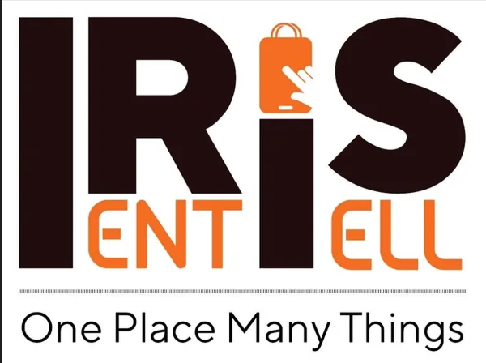
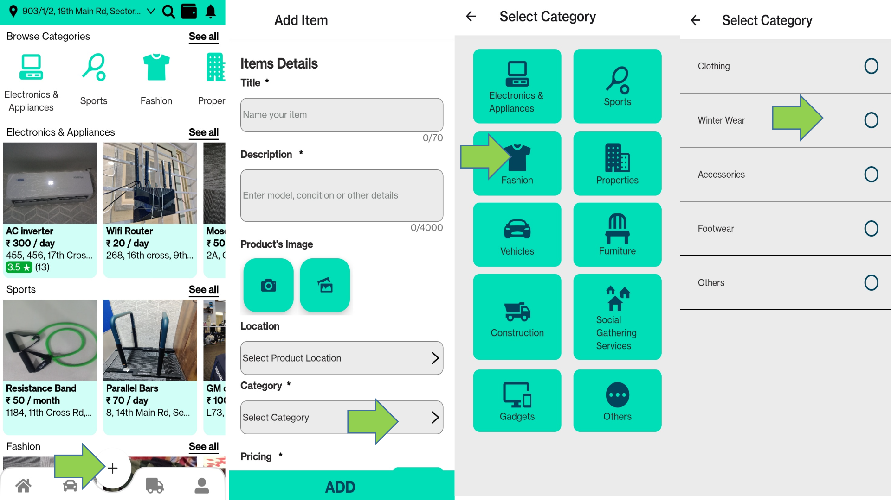
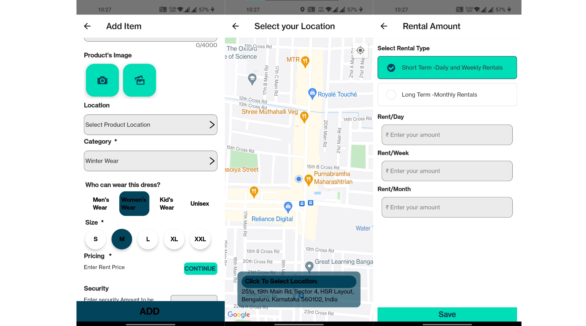
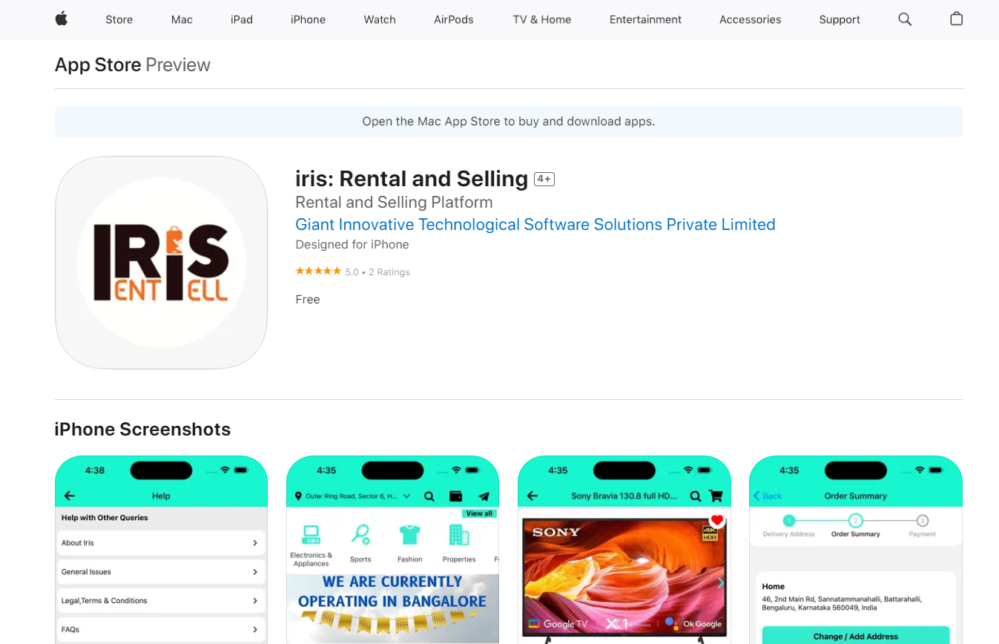
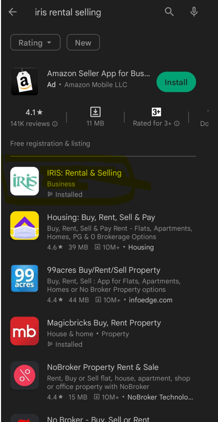
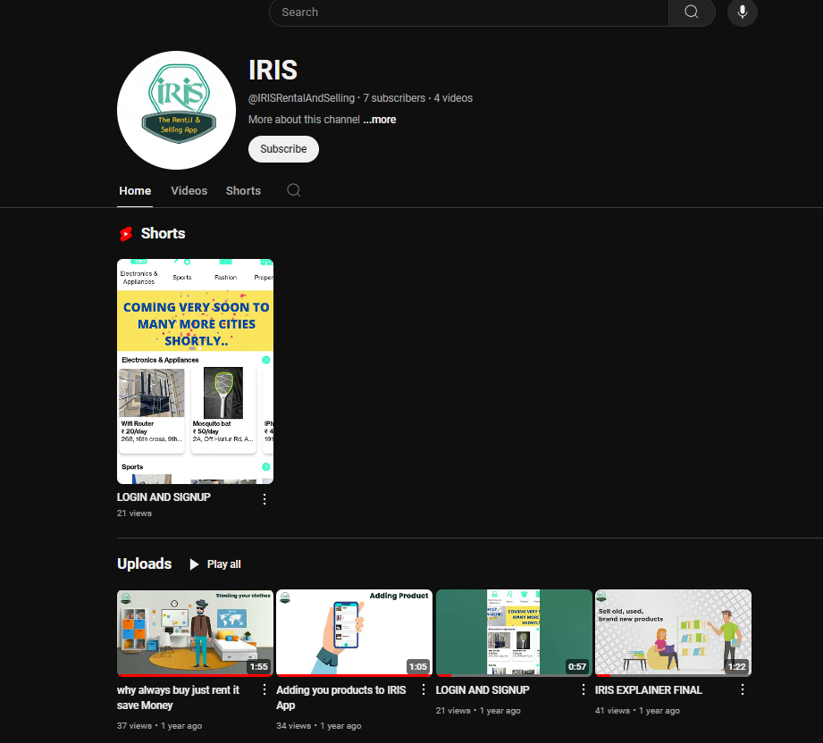
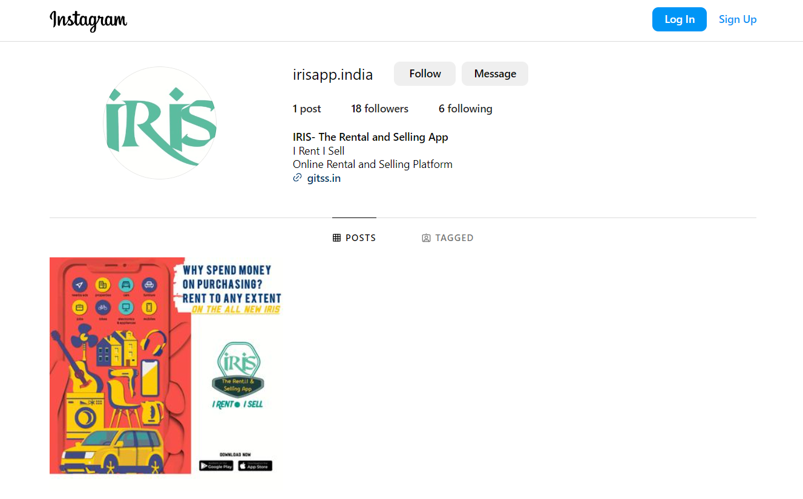

# iris-rental-and-selling-app
IRIS-RENTAL AND SELLING APPLICATION

## Abstract

**IRIS** is a cutting-edge online platform designed to revolutionize the way individuals interact with rental services. In today’s market, consumers are increasingly hesitant to invest in new products they may only need temporarily. IRIS addresses this need by offering a seamless digital solution for renting and selling a wide range of items at competitive prices. Our platform empowers users to easily connect with item owners, obtain comprehensive rental information, and experience a hassle-free rental process. Additionally, IRIS facilitates a robust selling feature, making it a versatile solution for both rental and sales needs.

## Project Description

**IRIS** is an advanced cross-platform mobile application developed using React Native, a powerful framework that enables the creation of native applications for both Android and iOS from a single codebase. React Native leverages JavaScript and React’s declarative UI paradigm to offer a consistent and high-performance user experience across multiple platforms.

Our project’s core objective is to deliver a comprehensive Full Stack React-Native Rental Mobile Application that provides users with a unified and intuitive interface for managing rentals and sales. Key features of IRIS include:

- **Product Listing and Management**: Users can list items for rent, view detailed rental information, and manage their listings through an easy-to-use interface.
- **End-to-End Rental Lifecycle Management**: From item listing to transportation, usage, and safe return, IRIS oversees the entire rental process, ensuring a smooth experience for both renters and owners.
- **Monetary Benefits**: IRIS facilitates a win-win scenario where item owners can earn money by renting out their products, while renters save money by avoiding purchases and gaining access to a wide variety of items.

With IRIS, we are redefining the rental experience by providing a user-centric, efficient, and financially beneficial platform for individuals looking to rent or sell items.

- [Link to documentation,usage and high level overview of implementation of application](https://docs.google.com/presentation/d/1iarKGYNGbCdwuBkBzp2qBsb-atlJVlDTnfl998O4iXU/edit?usp=sharing)

- [Link to Appstore](https://apps.apple.com/in/app/iris-rental-and-selling/id1664124763)

  

  
- [Link to Playstore](https://play.google.com/store/apps/details?id=com.irisrs)
  
- [Link to Download Android APK](https://drive.google.com/file/d/1qodylk54OYXDsTs3pyhFGytFeEWltQrU/view?usp=drivesdk)
  
  

  
- [Youtube Channel](https://www.youtube.com/@IRISRentalAndSelling)

  
  

  
- [Instagram Handle](https://www.instagram.com/irisapp.india/?igsh=MzRlODBiNWFlZA%3D%3D)

  
  

For sample implementation as part of our final year project, please refer to the [Sample snippet](Sample%20Git_Full%20Stack%20Mobile%20Application%20IRIS%20sample%20for%20University.pdf).
